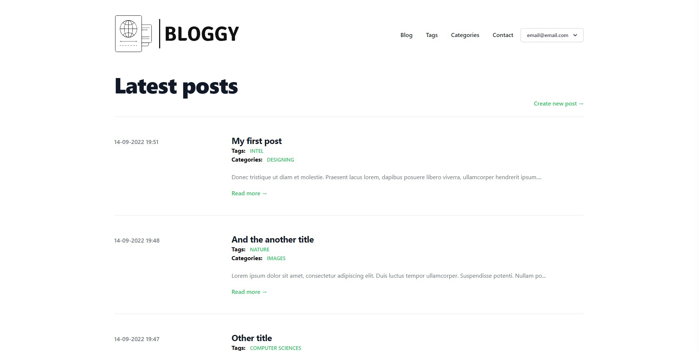
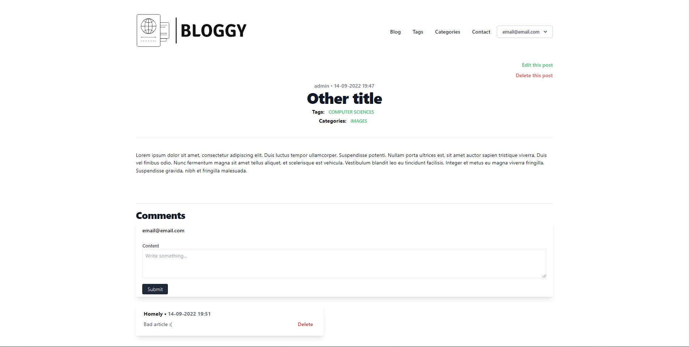
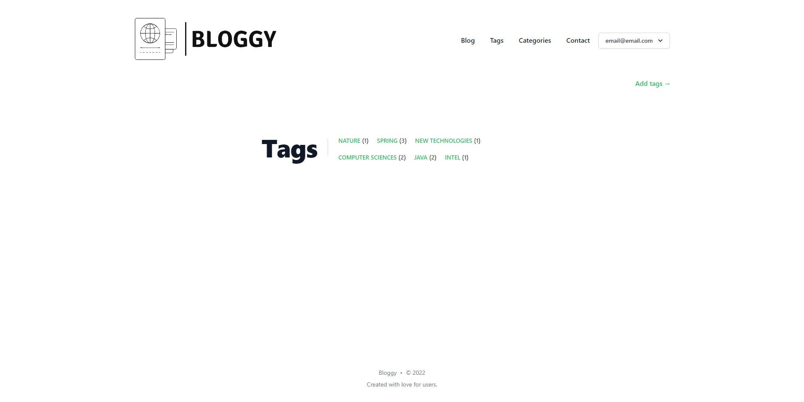
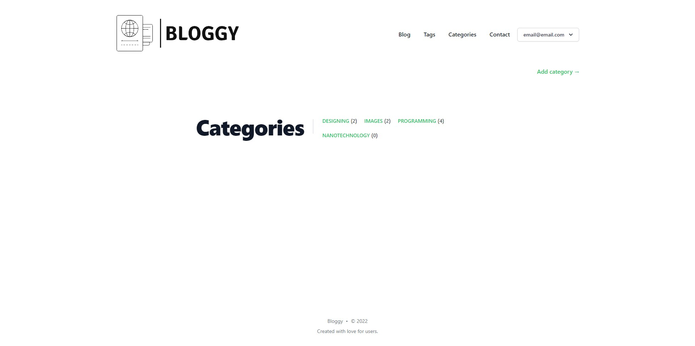
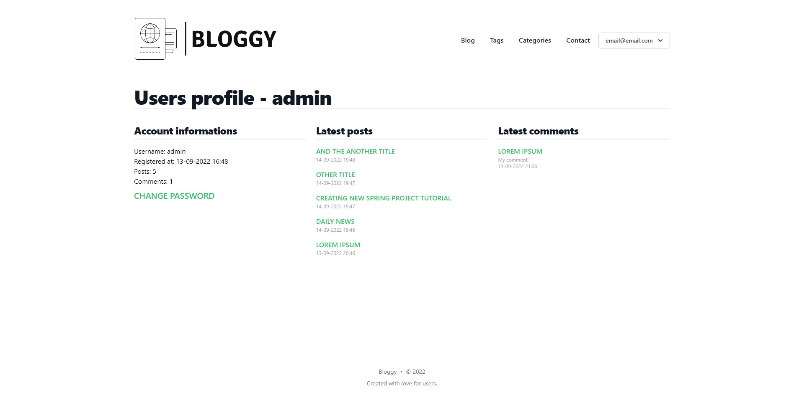
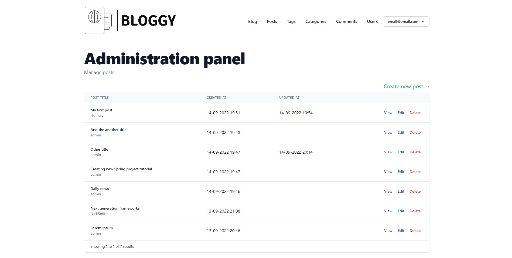
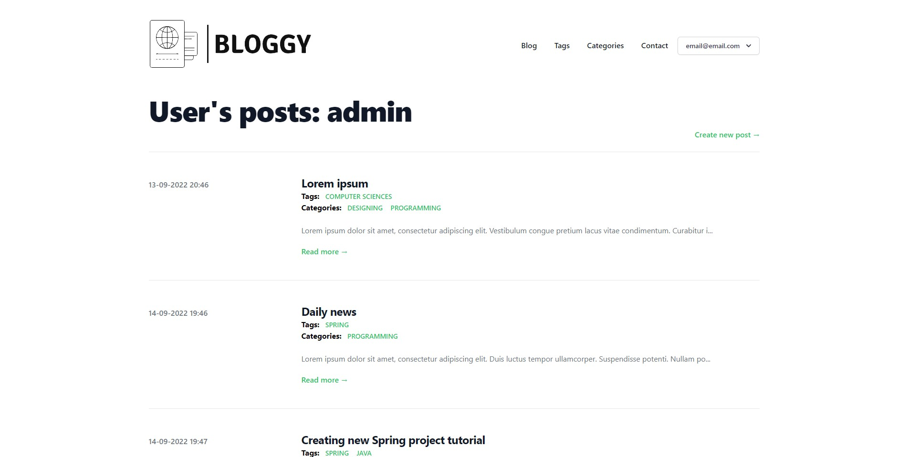
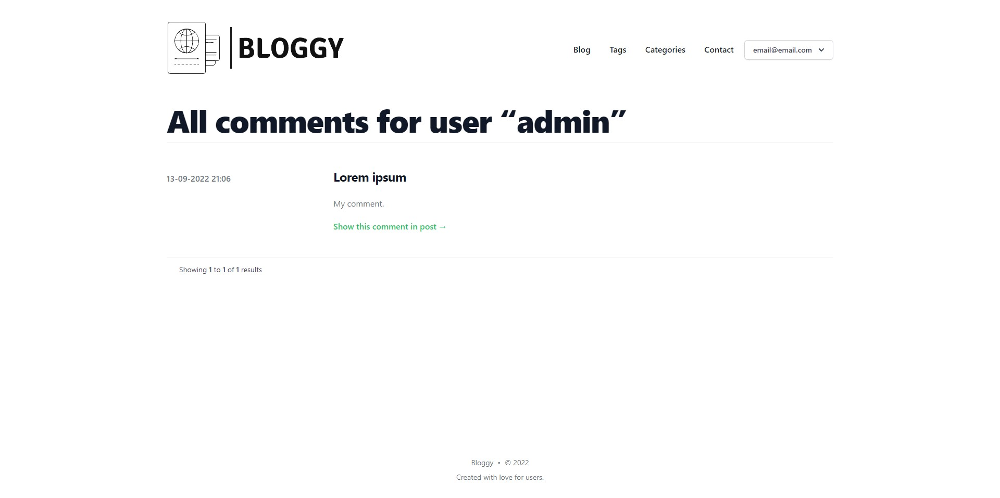

<h1 align="center">
    
</h1>

<p align="center">
    <a href="#features">Features</a>&nbsp;&nbsp; | &nbsp;
    <a href="#getting-started">Getting started</a>&nbsp; | &nbsp;
    <a href="#configuration">Configuration</a>&nbsp; | &nbsp;
    <a href="#used-technologies-and-tools">Technologies and tools</a>&nbsp; | &nbsp; 
    <a href="#screenshots">Screenshots</a>&nbsp; | &nbsp;
    <a href="#license">License</a>
</p>

# About
Bloggy is simple blog system to build community with different interests. You can create posts related with categories and tags. Search posts by categories and tags. Comment posts and share your interests with other users.\
Inspired by the <q>Tailwind Nextjs Starter Blog</q>: https://github.com/timlrx/tailwind-nextjs-starter-blog

<div align="center">
    
    Main page
</div>

# Features
- create and browse posts related with tags and categories
- comment all posts
- browse user's posts and comments
- view user profiles
- manage all resources from admin panel
- user-friendly, responsive layout

# Getting started
1. In project directory run docker compose command:
```
docker-compose up -d
```
2. To stop project just type command:
```
docker-compose down
```
3. App is on address `http://localhost:8080/`
4. Create admin account manually by adding it to database or set init mode in **docker-compose.yml**:\
To seed database with admin and user accounts:
```
SPRING_SQL_INIT_MODE=always
```
Restart server, check if account admin account exists:\
login: email@email.com\
password: Admin#12345\
**Remember to set init mode to never after doing this!**

# Configuration
 - Change database connection information for Spring environment in **docker-compose.yml**:
```dotenv
environment:
  - SPRING_DATASOURCE_URL=jdbc:postgresql://database:5432/bloggy
  - SPRING_DATASOURCE_USER=example
  - SPRING_DATASOURCE_PASSWORD=examplepassword123
  - SPRING_SQL_INIT_MODE=never
```
and set it also for database environment:
```
environment:
  POSTGRES_USER: "example"
  POSTGRES_PASSWORD: "examplepassword123"
  POSTGRES_DB: "bloggy"
```

# Used technologies and tools
- Java v17
- Spring Boot 3.0.0
- PostgreSQL
- Tailwind CSS v3.1.8
- Thymeleaf
- Docker and Docker Compose
- IDE: Jetbrains IntelliJ

# Screenshots








# License
Distributed under the MIT License.
